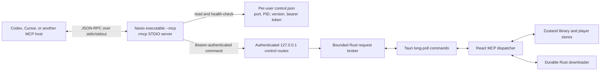

# Navio STDIO MCP Integration

## Introduction

Navio Player includes a local Model Context Protocol (MCP) server for Codex, Cursor, and other MCP-compatible agent hosts. The MCP server is packaged inside the same executable as the desktop player and is selected with the `--mcp` process argument.

The integration lets an agent inspect and control Navio while the user remains in the agent interface. It supports local music and video lookup, playback controls, volume, queue management, player presentation, durable download inspection, and download-then-play for an explicit URL.

This document is the source of truth for the MCP runtime, tool contracts, security boundaries, client configuration, verification, and maintenance requirements.

## Scope and invariants

The implementation must preserve these behaviors:

- MCP transport is local STDIO. Navio does not expose a remote MCP server.
- The desktop player remains the source of truth for playback, library, queue, and view state.
- Rust remains the security boundary for filesystem paths, process execution, runtime tokens, downloader operations, and local HTTP access.
- A title or natural-language name searches only media already indexed in the user's Navio library.
- A missing local match returns exactly `No music found.`
- Navio never converts a missing local result into an internet search.
- Online media is accepted only through `download_and_play_url` with an explicit URL supplied by the user.
- Online media is downloaded through Navio's durable downloader before playback begins.
- Tool responses never expose media filesystem paths, stream tokens, control tokens, or download output paths.
- The MCP process writes only JSON-RPC protocol messages to stdout. Startup and runtime failures use stderr.
- Multiple MCP hosts can control the same running desktop instance without maintaining separate player state.

## Runtime architecture



### One executable, two modes

`src-tauri/src/main.rs` selects the process mode before Tauri starts:

- No `--mcp` first argument: call `app_lib::run()` and start the normal desktop application.
- `--mcp` as the first argument: call `app_lib::run_mcp()` and run the `rmcp` STDIO service.

`src-tauri/src/lib.rs` creates a standalone Tokio runtime for MCP mode. The desktop WebView, plugins, and application event loop are not initialized inside the MCP process.

### Desktop discovery and automatic launch

Every MCP tool that needs application state goes through `NavioControlClient` in `src-tauri/src/mcp/client.rs`.

The client performs this sequence:

1. Read the current per-user runtime descriptor.
2. Send an authenticated request to `/control/health` on the descriptor's loopback port.
3. Reuse the descriptor only when health authentication succeeds.
4. If no healthy instance exists, acquire the per-user launch lock.
5. Recheck health after acquiring the lock to avoid a duplicate launch race.
6. Start `std::env::current_exe()` without `--mcp`.
7. Redirect the launched desktop process's stdin, stdout, and stderr to null so it cannot corrupt the MCP protocol stream.
8. Poll for a healthy runtime descriptor until the 15-second launch deadline.

On Windows, the spawned desktop process uses `CREATE_NO_WINDOW`. Competing MCP processes wait for the same descriptor instead of launching additional desktop instances.

Current timing limits:

| Limit                       |       Value | Source                     |
| --------------------------- | ----------: | -------------------------- |
| Desktop launch deadline     |  15 seconds | `DESKTOP_LAUNCH_TIMEOUT`   |
| Descriptor polling interval |      150 ms | `DESCRIPTOR_POLL_INTERVAL` |
| HTTP connect timeout        |   2 seconds | `NavioControlClient::new`  |
| HTTP request timeout        |  30 seconds | `NavioControlClient::new`  |
| Stale launch-lock age       |  20 seconds | `STALE_LAUNCH_LOCK_AFTER`  |
| Renderer reply timeout      |  15 seconds | `DEFAULT_CONTROL_TIMEOUT`  |
| Control request body        |      16 KiB | `MAX_CONTROL_BODY_BYTES`   |
| Broker queue capacity       | 32 requests | `application.rs`           |

## Private loopback control protocol

The MCP process does not invoke Tauri commands or access renderer state directly. It sends typed requests to private routes mounted on Navio's existing dynamic loopback server.

### Runtime descriptor

The desktop app publishes `navio-player/control.json` below the platform's per-user runtime or local-data directory. Examples include `%LOCALAPPDATA%\navio-player\control.json` on Windows when no runtime directory is available and `$XDG_RUNTIME_DIR/navio-player/control.json` on Linux when `XDG_RUNTIME_DIR` is configured.

The descriptor contract is:

```json
{
  "version": 1,
  "pid": 12345,
  "port": 41234,
  "token": "per-run-control-bearer-token",
  "executable": "absolute path to the running Navio executable"
}
```

Rules:

- `version` must equal `1`.
- `port` must be non-zero.
- `token` must contain at least 16 characters.
- The descriptor is written through a temporary file and then published at the final path.
- Unix files are created with mode `0600`.
- Graceful shutdown removes the descriptor only if its PID still belongs to the exiting process.
- A malformed, unsupported, unreachable, or unauthorized descriptor is treated as unhealthy.

The sibling `launch.lock` file serializes automatic desktop startup. Lock ownership is released through `Drop`; a lock older than 20 seconds can be replaced.

### HTTP routes

The control routes bind only through the existing `127.0.0.1:0` Axum listener:

| Method | Route              | Purpose                                                                            |
| ------ | ------------------ | ---------------------------------------------------------------------------------- |
| `GET`  | `/control/health`  | Authenticate the descriptor and confirm protocol version `1` is ready.             |
| `POST` | `/control/command` | Submit one serialized `ControlCommand` and wait for its correlated renderer reply. |

Both routes require:

```text
Authorization: Bearer <descriptor token>
```

The control token is generated independently from the media-stream token. The control router does not add CORS middleware. Invalid authentication returns HTTP `401`. Oversized command bodies return HTTP `413`. Broker saturation or renderer timeout returns HTTP `503` with a failed `ControlReply`.

### Broker and renderer handoff

`ControlBroker` uses:

- a bounded Tokio MPSC channel for FIFO command delivery;
- a UUID for every request;
- a pending UUID-to-oneshot map for response correlation;
- `try_send` to reject requests when the queue is full;
- a 15-second timeout that removes abandoned pending state.

The React root mounts `useMcpControl()` once from `src/routes/__root.tsx`. The hook uses these custom Tauri commands:

| Tauri command                   | Contract                                                                                                   |
| ------------------------------- | ---------------------------------------------------------------------------------------------------------- |
| `wait_for_mcp_command`          | Long-poll until the broker has a `PendingControlRequest`.                                                  |
| `complete_mcp_command`          | Complete one UUID with `success`, optional `message`, and optional JSON `data`.                            |
| `inspect_authorized_media_file` | Convert one completed download path into a playable `MediaItem` only after canonical allowlist validation. |

Browser-only frontend development remains usable because the hook dynamically imports Tauri APIs and stops quietly when they are unavailable.

## MCP server contract

The server identifies itself as:

```text
name: navio-player
version: 0.1.0
transport: STDIO
```

The server instruction requires agents to search the local library before playing a loose title, report `No music found.` on a missing match, never search the internet implicitly, never invent a URL, and call `download_and_play_url` only for a URL explicitly supplied by the user.

### Response envelope

Every tool returns JSON text containing the same logical envelope:

```json
{
  "success": true,
  "message": "Optional concise status",
  "data": {}
}
```

Failures use:

```json
{
  "success": false,
  "message": "Concise user-facing failure",
  "data": null
}
```

Agents must inspect `success`; a successful MCP protocol call can still contain a Navio operation failure.

## Tool reference

### `get_playback_state`

Parameters: none.

Returns the current track metadata, playing state, current time in seconds, integer volume percentage, active queue index, queue length, drawer state, and theater state.

The current track includes only safe metadata:

```json
{
  "id": "stable-track-id",
  "name": "Example.mp3",
  "title": "Example",
  "duration_secs": 180,
  "file_size_bytes": 12345678,
  "media_type": "audio"
}
```

Filesystem paths, cover-cache paths, streaming ports, and tokens are omitted.

### `search_library`

Parameters:

```json
{
  "query": "midnight drive",
  "media_type": "audio",
  "limit": 10
}
```

Contract:

- `query` is required after trimming and contains 1 through 200 characters.
- `media_type` is optional and accepts `audio` or `video`.
- `limit` is optional, defaults to `10`, and accepts `1` through `50`.
- Search is case-insensitive over local track title and filename.
- Ranking is exact match, prefix match, then substring match, preserving library order within the same rank.
- Search never reads arbitrary paths and never uses the network.
- An empty result is successful and contains an empty `tracks` array. The agent must tell the user exactly `No music found.`

### `play_media`

Parameters:

```json
{
  "track_id": "stable-track-id"
}
```

or:

```json
{
  "name": "Exact local title or filename"
}
```

At least one non-empty selector is required. `track_id` is preferred because it comes from `search_library` and is unambiguous. Name selection is exact and case-insensitive; it is not a loose search. A missing selection returns `No music found.` and does not trigger online lookup.

Playback uses the shared `playTrack` store action, updates the active queue, opens the drawer, and keeps video theater state consistent with existing player behavior.

### `control_playback`

Parameters:

```json
{
  "action": "seek_by",
  "seconds": 30
}
```

Supported actions:

- `play`
- `pause`
- `stop`
- `next`
- `previous`
- `seek_to`
- `seek_by`

`seconds` is required and finite only for `seek_to` and `seek_by`. Seeking clamps to zero and, when the active media element exposes a finite duration, to that duration. `stop` pauses playback and resets both renderer state and the HTML media position to zero.

If there is no current track, the tool returns `No music found.`

### `set_volume`

Parameters:

```json
{
  "volume": 65
}
```

`volume` must be an integer from `0` through `100`. The shared store updates both Navio state and the active media element.

### `get_queue`

Parameters: none.

Returns `active_index` and an ordered `tracks` array using the same path-free track serialization as `get_playback_state`.

### `edit_queue`

Add a local track:

```json
{
  "action": "add",
  "track_id": "stable-track-id"
}
```

Remove an item:

```json
{
  "action": "remove",
  "index": 1
}
```

Clear upcoming media:

```json
{
  "action": "clear"
}
```

Play an item by queue index:

```json
{
  "action": "play_index",
  "index": 0
}
```

Indexes are zero-based. `add` requires a local track ID. `remove` and `play_index` require an in-range integer index. Clearing retains the current track as a singleton queue when media is active. Removing the active item selects a valid replacement when one exists; removing the final item stops playback and clears the active track.

### `set_player_view`

Parameters:

```json
{
  "view": "theater"
}
```

Supported views:

- `hidden`: close drawer and theater.
- `drawer`: show Now Playing without theater mode.
- `theater`: show the video theater.

Theater requires an active video and fails for audio or no current media.

### `download_and_play_url`

Parameters:

```json
{
  "url": "https://example.com/media",
  "media_type": "video"
}
```

Contract:

- `url` must parse as an explicit `http`, `https`, `ftp`, or `ftps` URL.
- URLs containing embedded username or password credentials are rejected.
- Local files, arbitrary paths, and title strings are rejected.
- `media_type` accepts `audio` or `video`.
- The URL first passes Navio's existing downloader inspection.
- Navio creates a normal durable, non-playlist download with existing safe defaults.
- Audio requests use `bestaudio`; video requests use `best`.
- The tool returns immediately with `{ "job_id": "...", "status": "queued" }`.
- Completion is asynchronous. The renderer listens for the durable job update, validates the first completed path through Rust's existing streaming allowlist, converts it into a `MediaItem`, and then calls the shared player action.
- Failed, cancelled, or removed jobs clear their pending autoplay registration.

### `get_downloads`

Parameters:

```json
{
  "job_id": "optional-durable-job-id"
}
```

Omit `job_id` to return all durable jobs. Returned fields include ID, source URL, requested format, status, title, progress, speed, ETA, size, whether an error exists, collection position, completed-file count, and timestamps.

The response deliberately omits `completed_paths` and raw error details so MCP hosts cannot recover private filesystem locations from download status.

## Recommended agent workflow

For a local title request:

1. Call `search_library` with the user's words and optional media type.
2. If no tracks are returned, respond exactly `No music found.`
3. If one match clearly satisfies the request, call `play_media` with its ID.
4. If several matches are plausible, ask the user to choose or use the most explicit information already supplied.

For an explicit URL:

1. Confirm that the user supplied the URL; do not invent or discover one.
2. Call `download_and_play_url` with `audio` or `video`.
3. Report the queued job ID.
4. Use `get_downloads` when the user asks for progress or completion state.

For state changes, use the narrowest tool. For example, use `set_volume` instead of guessing at general player state, and call `get_playback_state` before a state-dependent action when the current media is unknown.

## Client configuration

Use an absolute path to the installed Navio desktop executable. A source build on Windows produces the Rust binary below `src-tauri\target\release\app.exe`; bundled installer output is written below `src-tauri\target\release\bundle\`. Installed executable naming and location follow the selected operating-system bundle.

### Codex

Windows example:

```text
codex mcp add navio -- "C:\Program Files\Navio Player\Navio Player.exe" --mcp
```

Development release-binary example from the repository root:

```text
codex mcp add navio-dev -- "F:\PROGRAMMING\PROJECTS\ardio\src-tauri\target\release\app.exe" --mcp
```

Codex uses the registered command and arguments for its CLI, IDE integration, and desktop app. Remove and re-add the server if the executable path changes.

### Cursor

Add a server entry to the applicable Cursor MCP JSON configuration:

```json
{
  "mcpServers": {
    "navio": {
      "command": "C:\\Program Files\\Navio Player\\Navio Player.exe",
      "args": ["--mcp"]
    }
  }
}
```

For a repository release build:

```json
{
  "mcpServers": {
    "navio-dev": {
      "command": "F:\\PROGRAMMING\\PROJECTS\\ardio\\src-tauri\\target\\release\\app.exe",
      "args": ["--mcp"]
    }
  }
}
```

Restart or refresh MCP servers after changing configuration. The host may require approval before executing tools that change playback or start a download.

## Build and verification

### Frontend verification

```text
npm run lint
npm run typecheck
npm run test
npm run build
```

`npm run build` creates the SPA output. Tauri's configured `beforeBuildCommand` uses `npm run build:tauri`, which runs the frontend build and prepares `dist/client/index.html` from the TanStack Start shell.

### Rust verification

```text
cargo fmt --manifest-path src-tauri/Cargo.toml --check
cargo clippy --manifest-path src-tauri/Cargo.toml --all-targets -- -D warnings
cargo test --manifest-path src-tauri/Cargo.toml
```

The Rust tests cover:

- bounded broker FIFO delivery, correlation, saturation, timeout cleanup, and unknown IDs;
- bearer-authenticated health and command routes plus body limits;
- runtime descriptor validation, atomic replacement, and launch-lock exclusivity;
- allowlisted downloaded-media inspection;
- MCP parameter validation and exact server instructions;
- JSON-RPC initialization and exposure of all ten tools.

### Desktop production build

```text
npm run tauri build
```

This runs the configured frontend preparation, compiles the release Rust executable, and creates platform bundles under `src-tauri/target/release/bundle/`.

### STDIO smoke test

The protocol smoke test must verify:

1. Start the built executable with `--mcp` and piped stdin/stdout.
2. Send one newline-delimited JSON-RPC `initialize` request.
3. Verify `result.serverInfo.name` equals `navio-player`.
4. Send `notifications/initialized`.
5. Send `tools/list`.
6. Verify the response contains exactly the ten documented tool names.
7. Verify every stdout line parses as JSON-RPC and no application log text appears.
8. Close stdin and verify the MCP process exits.

The automated equivalent lives in `src-tauri/src/mcp/mod.rs` as `json_rpc_transport_initializes_and_lists_all_tools`. A built-binary smoke test should repeat the same handshake against the release executable.

## Security model

### Trust boundaries

- MCP hosts can request only the ten declared tools.
- Tool parameters are schema-generated through `schemars` and validated again in Rust or TypeScript.
- The STDIO process does not receive direct Tauri state or arbitrary filesystem APIs.
- The loopback bridge requires a high-entropy per-run bearer token read from a per-user descriptor.
- Media-stream and control tokens are separate.
- The HTTP listener binds to `127.0.0.1` on a dynamic port.
- The control router has no CORS policy enabling browser origins.
- The body, broker queue, and response wait are bounded.
- Downloaded paths must already be inside Navio's existing streaming allowlist before metadata inspection and autoplay.
- Track and download serialization removes local paths before data returns to an MCP host.

### Explicit network boundary

`search_library` and `play_media` are closed-world local tools. Their MCP annotations set `open_world_hint` to `false`. `download_and_play_url` is the only tool annotated as open-world, and its URL must originate from the user's request.

Navio does not provide a title-to-URL resolver, search provider, remote catalog, OAuth flow, cloud account, or remotely reachable MCP endpoint.

## Failure behavior and troubleshooting

### MCP server is not listed

- Confirm the client configuration points to the actual executable, not the installer package.
- Confirm `--mcp` is a separate argument.
- Use an absolute command path.
- Restart or refresh the MCP host after editing its configuration.

### Navio does not open on the first tool call

- Tool listing does not launch the desktop app; the first stateful tool call does.
- Confirm the desktop executable can start normally without `--mcp`.
- Remove a stale `launch.lock` only after confirming no Navio MCP process is currently starting the app. The implementation normally replaces locks older than 20 seconds.
- A failed launch returns `Navio could not be launched in time.` after 15 seconds.

### Tool calls return an HTTP status failure

- A stale descriptor can point to a process that exited uncleanly. The next call health-checks it and attempts a new launch.
- HTTP `401` means the descriptor token does not authenticate the running process.
- HTTP `413` means a request exceeded the 16 KiB control-body limit.
- HTTP `503` means the broker was full or the renderer did not answer within 15 seconds.

### Local media cannot be found

- Confirm the folder is part of Navio's scanned library.
- Use `search_library` for loose words and pass the returned ID to `play_media`.
- Direct `play_media` names must exactly match a local title or filename, ignoring case.
- The correct missing-result response remains `No music found.`; do not work around it with an online search.

### A download completes but does not autoplay

- Confirm the job was created by `download_and_play_url` in the current renderer session.
- Inspect it with `get_downloads` and confirm `status` is `completed` and `completed_file_count` is greater than zero.
- The completed file must remain inside Navio's authorized download directory and use a supported audio or video extension.
- Failed or cancelled jobs intentionally clear autoplay registration.

## Implementation file map

| File                               | Responsibility                                                                                |
| ---------------------------------- | --------------------------------------------------------------------------------------------- |
| `src-tauri/src/main.rs`            | Select desktop or `--mcp` mode.                                                               |
| `src-tauri/src/lib.rs`             | Create the standalone MCP Tokio runtime and hold shared application state.                    |
| `src-tauri/src/mcp/mod.rs`         | Declare tools, annotations, server instructions, response conversion, and STDIO service.      |
| `src-tauri/src/mcp/params.rs`      | Define JSON schemas and validate tool parameters.                                             |
| `src-tauri/src/mcp/client.rs`      | Discover, authenticate, launch, and call the desktop app.                                     |
| `src-tauri/src/control/models.rs`  | Define typed control commands, pending requests, and replies.                                 |
| `src-tauri/src/control/broker.rs`  | Bound and correlate HTTP-to-renderer requests.                                                |
| `src-tauri/src/control/runtime.rs` | Manage the runtime descriptor and launch lock.                                                |
| `src-tauri/src/control/http.rs`    | Authenticate and serve private loopback control routes.                                       |
| `src-tauri/src/server/startup.rs`  | Mount control routes beside media streaming.                                                  |
| `src-tauri/src/application.rs`     | Generate tokens, create the broker, publish the descriptor, and clean up on exit.             |
| `src-tauri/src/commands.rs`        | Expose the broker long poll/completion and allowlisted media inspection to the renderer.      |
| `src/hooks/useMcpControl.ts`       | Own the renderer command loop and download autoplay listener.                                 |
| `src/lib/mcpControl.ts`            | Dispatch commands, validate renderer inputs, search local tracks, and serialize safe replies. |
| `src/store/playerStore.ts`         | Provide shared stop, seek, volume, playback, view, and queue mutations.                       |
| `src/routes/__root.tsx`            | Mount the MCP renderer hook once.                                                             |
| `src/lib/mcpControl.test.ts`       | Verify local search, dispatch, player actions, download privacy, and autoplay.                |

## Maintenance checklist

When adding or changing an MCP tool:

- [ ] Add or update the typed `ControlCommand` variant.
- [ ] Add a strict `JsonSchema` parameter type and conditional validation.
- [ ] Add the tool to `NavioMcp` with accurate read-only, destructive, idempotent, and open-world annotations.
- [ ] Add the corresponding `McpControlCommand` TypeScript variant.
- [ ] Dispatch through existing Zustand or downloader actions instead of creating duplicate state.
- [ ] Remove filesystem paths, tokens, and internal error details from returned data.
- [ ] Add Rust tests for parameter mapping and tool exposure.
- [ ] Add TypeScript tests for renderer behavior and privacy.
- [ ] Update the tool reference and agent workflow in this document.
- [ ] Run every frontend and Rust verification command listed above.
- [ ] Repeat the built-binary STDIO handshake when process startup or transport code changes.
